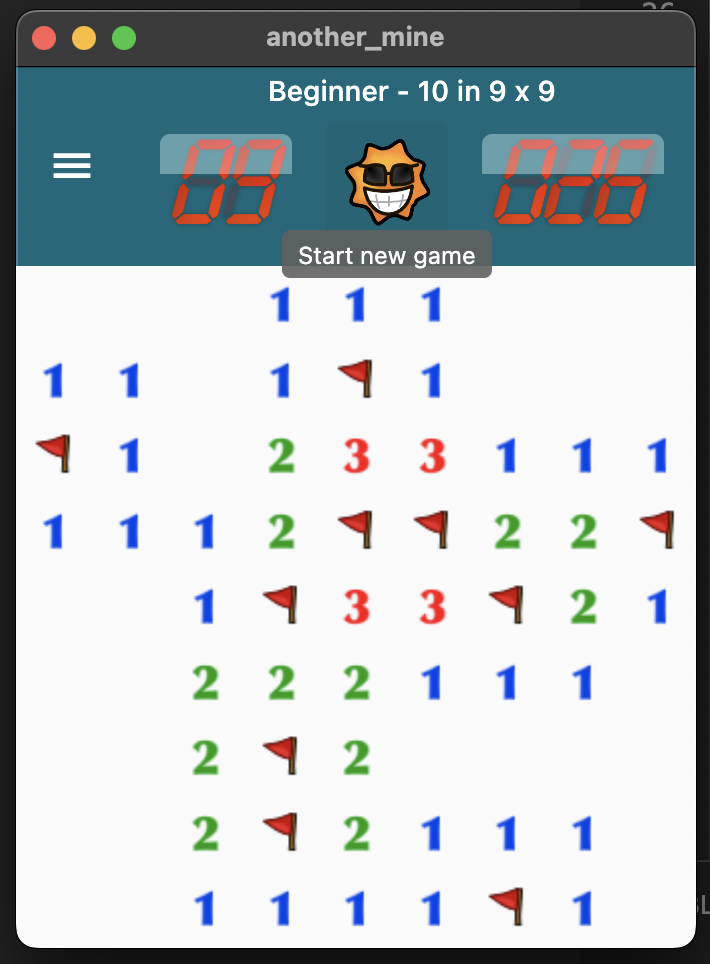

# Another Mine

A modern, cross-platform Minesweeper clone built with Flutter.



## Overview

Another Mine is a fully featured implementation of the classic Minesweeper game. It brings the familiar logic to mobile, web, and desktop platforms using Flutter, enhanced with an Autosolver AI and a clean, responsive UI.

## Features

-   **Classic Gameplay**: Familiar Minesweeper rules and mechanics.
-   **Difficulty Levels**:
    -   **Beginner**: 9x9 grid, 10 mines.
    -   **Intermediate**: 16x16 grid, 40 mines.
    -   **Expert**: 30x16 grid, 99 mines.
-   **Autosolver AI**: A built-in probabilistic solver that can play the game for you or provide hints.
-   **Cross-Platform**: Runs on Android, iOS, macOS, Windows, Linux, and Web.
-   **Responsive Design**: scales to fit different screen sizes.
-   **Game State Management**: Robust state handling using `flutter_bloc`.

## AI Solvers

The game includes two auto-solver strategies located in `lib/ai/`:

### Simple Guesser
A heuristic-based solver that uses standard Minesweeper logic rules. It scans the board for revealed numbers and applies two primary tactics:
1.  **Flagging**: If the number of unrevealed neighbors equals the tile's value (minus existing flags), all unrevealed neighbors are mines.
2.  **Clearing**: If the number of flagged neighbors equals the tile's value, all other unrevealed neighbors are safe.
If no logical moves are found, it makes a random guess.

### Probability Guesser
An advanced solver that uses constraint satisfaction and probability calculation.
1.  **Certainty**: Prioritizes moves with 100% certainty (safe or mine) derived from global board constraints.
2.  **Probability**: If no certain moves exist, it calculates the mine probability for every unrevealed tile and picks the safest one (lowest probability).
This solver is significantly more effective than the Simple Guesser, especially in complex end-game situations.

## Tech Stack

-   **Framework**: [Flutter](https://flutter.dev/)
-   **State Management**: [flutter_bloc](https://pub.dev/packages/flutter_bloc) & [bloc](https://pub.dev/packages/bloc)
-   **Navigation**: [go_router](https://pub.dev/packages/go_router)
-   **Equality**: [equatable](https://pub.dev/packages/equatable)
-   **Logging**: [logging](https://pub.dev/packages/logging)
-   **Local Storage**: [shared_preferences](https://pub.dev/packages/shared_preferences)

## Getting Started

### Prerequisites

-   [Flutter SDK](https://docs.flutter.dev/get-started/install) installed on your machine.
-   An IDE (VS Code, Android Studio, or IntelliJ) with Flutter plugins.

### Installation

1.  **Clone the repository:**

    ```bash
    git clone https://github.com/billy1380/another_mine.git
    cd another_mine
    ```

2.  **Install dependencies:**

    ```bash
    flutter pub get
    ```

3.  **Run the app:**

    ```bash
    # Run on the connected device or emulator
    flutter run
    ```

## Project Structure

-   `lib/ai/`: Logic for the AI Autosolver.
-   `lib/bloc/`: BLoC definitions for state management (Game, Settings).
-   `lib/model/`: Data models and enums (Tile, Difficulty, GameState).
-   `lib/pages/`: UI screens (GamePage, StartupPage).
-   `lib/widgets/`: Reusable UI components (Tile, MineField, Digits).
-   `lib/services/`: Shared services and utilities.
